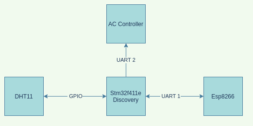
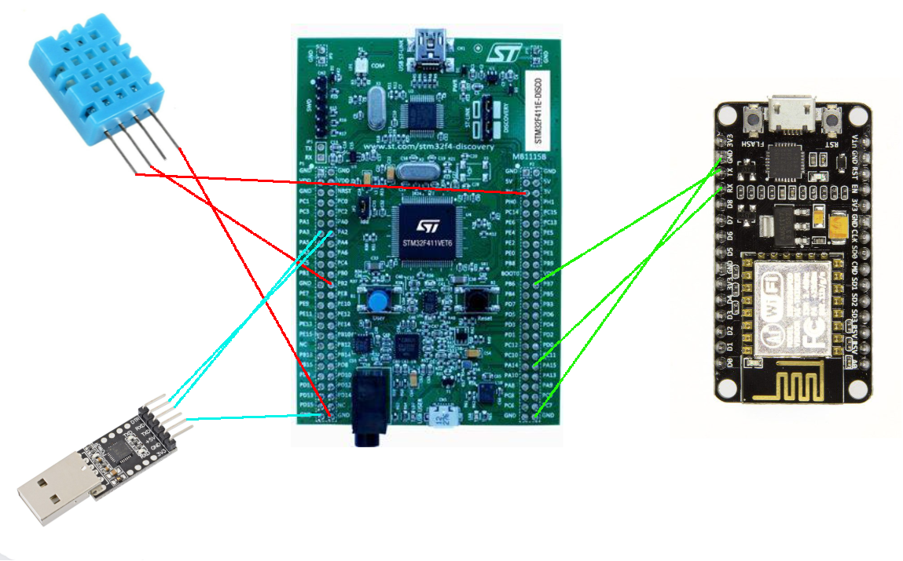
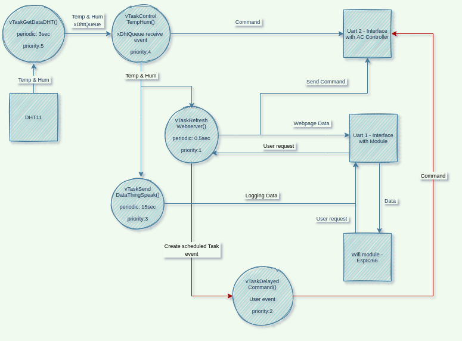

# Informe de desarrollo aplicación de control de un aire acondicionado (AC) usando FreeRTOS

### Materia: MICROCONTROLADORES – SISTEMAS EMBEBIDOS - 2021

### Alumno: Mérida Renny, Julián

# Introducción

Como proyecto final para la materia de Microcontroladores y Sistemas Embebidos, se desarrolló una aplicación utilizando FreeRTOS para manejar el control de un aire acondicionado. Se definió previamente una API de control del AC y en base a esta se desarrolló la aplicación.

El principal objetivo de la aplicación es permitir, mediante la medición constante cada 3 segundos de la temperatura y la humedad, enviar los comandos de control a través de una UART para mantener los valores en un rango específico, o bien en un solo valor. Además, cada 15 segundos las mediciones son enviadas a la página web `ThingSpeak` para llevar un control de las variaciones de los valores aprovechando los gráficos que la web realiza. Por último, posibilita programar comandos para que sean ejecutados en el futuro especificando el tiempo en segundos, minutos, horas y/o días.

# Recursos de hardware

Los recursos de hardware utilizados son:

* Sensor Dht11 para la medición de la temperatura y la humedad.

* Placa NodeMCU V3 LiLon que implementa el microchip ESP8266.

* (Opcional) Adaptador UART a Usb para conectar la interfaz de salida de los comandos a la PC.

## Diagrama de conexiones de los bloques de hardware

En el siguiente gráfico se muestra la interacción entre los distintos recursos de hardware. La placa Discovery se comunica mediante un pin `GPIO` con el sensor dht11 para comenzar y sincronizar la medición. Con la placa NodeMCU se comunica por la primera interfaz `UART` para recibir los comandos que el usuario ingresa mediante la página web, y envía el html para ser renderizado por el navegador, junto con las últimas mediciones que realizó el sensor para mostrarlas. También transmite al servidor `thingSpeak` las últimas mediciones para realizar los gráficos. En última instancia, envía a la segunda interfaz `UART` los comandos de control que correspondan.

En el siguiente grafico, podemos ver la disposición de las conexiones reales:

# Comandos posibles de la API:

**Prender aire:**

    do=turnOn.

**Apagar aire:**

    do=turnOff.

**Seleccionar un valor de temperatura específica:**

    do=setTemp,x.

*donde `x` es un valor entre 0 y 50.*

En caso de introducir la palabra `clear` se dejará de controlar el valor.

**Seleccionar un valor de humedad específica:**

    do=setHum,x.

*donde `x` es un valor entre 5 y 90.*

En caso de introducir la palabra `clear` se dejará de controlar el valor.

**Seleccionar un rango de temperatura específico:**

    do=setRangeTemp,x,y.

*donde `x` es el valor mínimo e `y` es el valor máximo.*

En este caso se conseguirá que la temperatura siempre se mantenga dentro de ese rango. También, al introducir la palabra `clear` como alguno de los argumentos, se reinicia el control.

**Seleccionar un rango de humedad específico:**

    do=setRangeHum,x,y.

*donde `x` es el valor mínimo e `y` es el valor máximo.*

En este caso se conseguirá que la humedad siempre se mantenga dentro de ese rango. Igual que en el caso anterior, al introducir `clear` en alguno de los argumentos, se reincia el control.

**Enviar 3 posibles comandos especiales:**

    do=specialx,y,z.

*en donde `x` es un valor entre {1,2,3}, `y` es el argumento 1 y `z` es el argumento 2.*

La funcionalidad de estos comandos es permitir la implementación de algún comando especial extra que posea el control o el aire acondicionado.

**Programar alguno de los comandos anteriores para que se ejecute en el futuro:**

Aquí se elige de la lista uno de los comandos descriptos anteriormente, se seleccionan los días, horas, minutos y/o segundos correspondientes junto a los parámetros, en caso de que sean  necesarios, y se envía el comando.

# Diagrama tareas FreeRTOS

La aplicación FreeRTOS desarrollada consta de 5 tareas:

* `vTaskGetDataDHT` es la tarea que se encarga de realizar las mediciones al sensor Dht11, se ejecuta cada 3 segundos y luego envía, por la cola `xDhtQueue`, los valores obtenidos a la tarea de control `vTaskControlTempHum`.

* `vTaskSendDataThingSpeak` es la tarea que lee el dato de memoria que `vTaskControlTempHum` actualizó y los envía a la web `thingSpeak`. Tiene un periodo de 15 segundos, ya que este es el tiempo mínimo que admite la web para enviar datos.

* `vTaskControlTempHum` esta tarea se desbloquea una vez que obtiene las mediciones de `vTaskGetDataDHT` a través de la cola `xDhtQueue`, revisa el modo actual, si se está controlando un valor o un rango específico de mediciones (tanto para la temperatura, como para la humedad), y envía el comando correspondiente para aumentar o disminuir dicho valor. Si el modo actual es el control de un rango, cuando la medida está por debajo del mínimo se comanda aumentar el valor hasta pasar el máximo, y viceversa para el caso por arriba del máximo.

* `vTaskRefreshWebserver` el trabajo de esta tarea es manejar el servidor web que permite la interacción del usuario con la aplicación mediante una conexión wifi. Se ejecuta cada 100ms y tiene la prioridad más baja de todas, ya que es importante que siempre que se pueda se esté ejecutando para proveerle al usuario una buena interacción. No obstante, se deja un tiempo libre para que la `idleTask` pueda ejecutarse. Además, esta tarea maneja los pedidos del usuario para realizar los cambios de temperatura o humedad, y la petición para ejecutar una tarea dentro de un tiempo determinado, recibiendo los parámetros y otorgando el semáforo `xSemaphoreOneShotTask`. También muestra en la página las últimas mediciones realizadas.

* `vTaskDelayedCommand` esta tarea se desbloquea con el semáforo `xSemaphoreOneShotTask`, recibe los datos (el comando, los argumentos y el tiempo a esperar) actualizados por `vTaskRefreshWebserver` y crea una tarea. Nuevamente, vuelve a bloquearse esperando el semáforo. La tarea creada se bloquea hasta que el tiempo solicitado haya transcurrido, luego envía la orden y se autodestruye.
