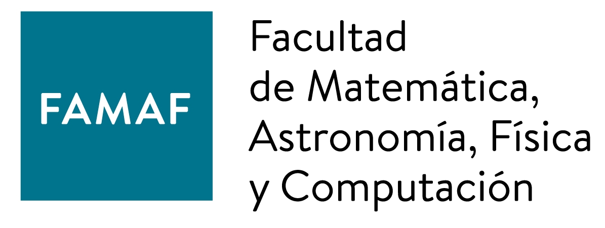
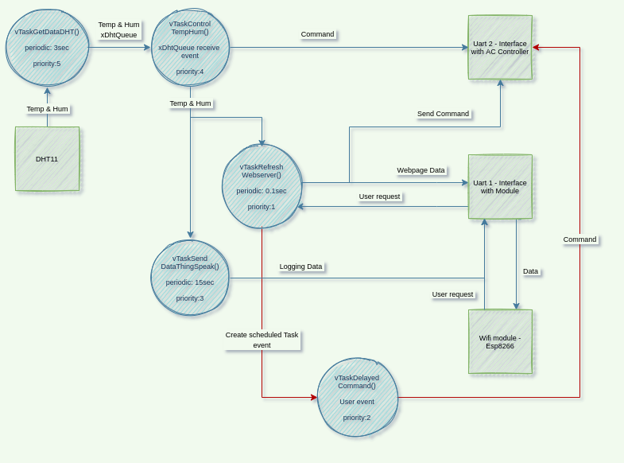

# Informe de desarrollo aplicación control de un AC usando RTOS

### Materia: MICROCONTROLADORES – SISTEMAS EMBEBIDOS - 2021

### Alumno: Merida Renny, Julián

# Introducción

Como proyecto final para la materia de Microcontroladores y sistemas embebidos se desarrolló una aplicación utilizando FreeRTOS para manejar el control de un aire acondicionado. Se definió previamente una API de control del AC y en base a esta se desarrolló la aplicación.

El principal objetivo de la aplicación es permitir, mediante la medición constante cada 3 segundos de la temperatura y la humedad, enviar los comandos de control a traves de una UART para mantener los valores en rango especifico o bien en un solo valor. Además, cada 15 segundos las mediciones son enviadas a la página web `ThingSpeak` para llevar un control de las variaciones de los valores aprovechando los gráficos que la web realiza. Por último, es posible programar comandos para que sean ejecutados en el futuro especificando el tiempo en segundos, minutos, horas y/o días.

# Recursos de hardware

Los recursos de hardware utilizados son:

* Sensor Dht11 para la medición de la temperatura y la humedad.

* Placa NodeMCU V3 LiLon que implementa el microchip ESP8266.

* (Opcional) Adaptador Uart a Usb para conectar la interfaz de salida de los comandos a la PC.

## Diagrama de conexiones de los bloques de hardware

En el siguiente gráfico se muestra la interacción entre los distintos recursos de hardware. La placa discovery se comunica mediante un pin `GPIO` con el sensor dht11 para comenzar y sincronizar la medición. Con la placa NodeMCU se comunica por la primera interfaz `UART` para recibir los comandos que el usuario ingresa mediante la página web y enviaa a la página web el html para ser renderizado por el navegador junto con las últimas mediciones que realizó el sensor para mostrarlas y tambien envía al servidor `thingSpeak` las últimas mediciones para realizar los gráficos. Por último, envía a la segunda interfaz `UART` los comandos de control que correspondan.

En el siguiente grafico, podemos ver la disposicón de las conexiones reales:

# Comandos posibles de la API:

Prender aire:

    do=turnOn.

Apagar aire:

    do=turnOff.

Seleccionar un valor de temperatura especifica:

    do=setTemp,x.

*donde `x` es un valor entre 0 y 50.*

Seleccionar un valor de humedad especifica:

    do=setHum,x.

*donde `x` es un valor entre 5 y 90.*

En caso de introducir

Seleccionar un rango de temperatura específico:

    do=setRangeTemp,x,y.

*donde `x` es el valor mínimo e `y` es el valor máximo.*

En este caso se conseguirá que la temperatura siempre se mantenga dentro del rango.

Seleccionar un rango de humedad específico:

    do=setRangeTemp,x,y.

*donde `x` es el valor mínimo e `y` es el valor máximo.*

Enviar 3 posibles comandos especiales:

    do=specialx,y,z.

*en donde `x` es un valor entre {1,2,3}, `y` es el argumento 1 y `z` es el argumento 2.*

La funcionalidad de estos comandos es permitir la implementación de algún comando especial extra que posea el control o el aire acondicionado.

Programar alguno de los comandos anteriores para que se ejecute en el futuro:

Aquí se elige de la lista uno de los comandos descriptos anteriormente, se selecciona los dias, horas, minutos y/o segundos correspondientes junto a los parámetros, en caso de que sean  necesarios, y se envía el comando.

# Diagrama tareas FreeRTOS

La aplicación FreeRTOS desarrollada consta de 5 tareas:

* `vTaskGetDataDHT` es la tarea que se encarga de realizar las mediciones al sensor Dht11, su ejecuta cada 3 segundos y luego envia por la cola `xDhtQueue` los valores obtenidos a la tarea de control `vTaskControlTempHum`.

* `vTaskSendDataThingSpeak` es la tarea que se encarga de obtener el dato de memoria que `vTaskControlTempHum` actualizó y los envia a la web de `thingSpeak`. Tiene un periodo de 15 segundos, ya que este es el tiempo mínimo que admite la web para enviar datos.

* `vTaskControlTempHum` esta tarea se desbloquea una vez que obtiene las mediciones de `vTaskGetDataDHT` a traves de la cola `xDhtQueue`, revisa el modo actual, si se está manteniendo un valor en especifico o un rango de mediciones (tanto para la temperatura, como para la humedad) y envía el comando correspondiente para aumentar o disminuir la medición. Si el modo actual es el control dentro de un rango, en caso de que la medida este por debajo del mínimo se comanda aumentar la temperatura o humedad hasta pasar el máximo y viceversa para el caso por arriba del máximo.

* `vTaskRefreshWebserver` el trabajo de esta tarea es manejar el servidor web que permite la interacción del usuario con la aplicación mediante una conexión wifi. Se ejecuta cada 500ms y tiene la prioridad más baja de todas ya que es importante que siempre que se pueda se esté ejecutando para proveerle al usuario una buena interacción pero se deja un tiempo libre para que la idleTask puede ejecutarse. Además, esta tarea maneja los pedidos del usuario para realizar los cambios de temperatura o humedad, la petición para ejecutar una tarea dentro de un tiempo determinado recibiendo los parámetros y otorgando el semaforo `xSemaphoreOneShotTask` y muestra en la página las ultimas mediciones realizadas.

* `vTaskDelayedCommand` esta tarea se desbloquea con el semáforo `xSemaphoreOneShotTask`, recibe el comando, los argumentos y el tiempo a esperar que actualizó `vTaskRefreshWebserver` antes de otorgar el semáforo, y crea una tarea con estos datos que obtuvo y vuelve a bloquearse esperando el semaforo nuevamente. La tarea creada se bloquea hasta que el tiempo solicitado haya transcurrido luego envia el comando y se autodestruye.
